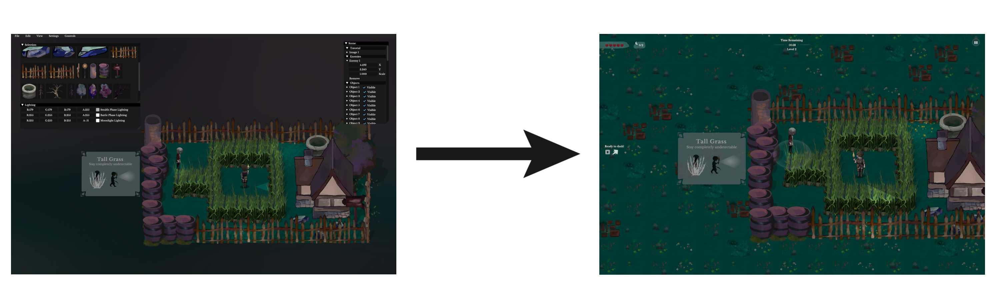

## Features
One of the unique highlights of Lunar Haze is its fully customizable level editor.
Thanks to ImGui Java bindings provided by SpaiR/imgui-java, the editor has a robust GUI for level creation.

To play Lunar Haze, head over to the Releases page. We provide an executable for Windows and an application for macOS. Just download the suitable version for your operating system, install it, and you're good to go.

If you would like to build from source, the source code comes with the gradle build system.

